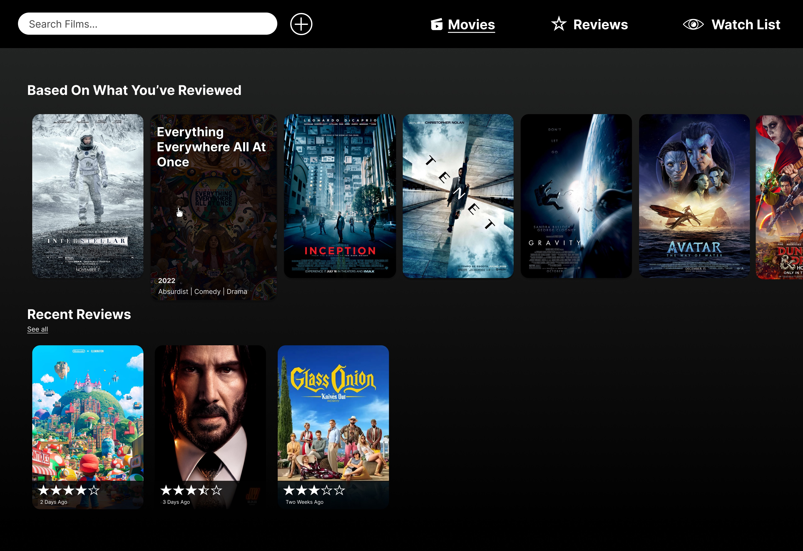

# Movie Tracker
<!-- (table might look a bit strange if not rendered in markdown) -->
## Package Dependencies
| Package  | Version | Purpose |
| -------- | ------- | --------|
| [parcel-bundler](https://www.npmjs.com/package/parcel) | 2.8.3 | Web application bundler with hot reloading |
| [express](https://www.npmjs.com/package/express) | 4.18.2 | Web server for serving static build files |
| [sass](https://www.npmjs.com/package/sass)  | 1.62.0 | CSS preprocessor which supports variables, mixins, and more | 
| [animejs](https://www.npmjs.com/package/animejs) | 3.2.1  | Easy animation of DOM elements in javascript | 

## Deployment Procedures

### Install Application Dependencies
Install [NodeJS](https://nodejs.org/en/) and ensure the `node` and `npm` commands are available in your command line interface. 

### Install Dependencies
Use [npm](https://www.npmjs.com/) to install all dependencies in the project root directory.
> `npm install`

### Run Development Server
Run a local development server with hot reloading using [ParcelJS](https://parceljs.org/). The development server will serve the files in the `src` directory on port 1234 by default.
> `npm run dev`

### Build Production Files
Build production files in the `dist` directory.
> `npm run build`

### Run Production Server
the production server will serve the build files in the `dist` directory using ExpressJS on port 8888 by default.
> `node server.js`

## Design Iterations
Changes since initial mockups.

### Removed Watchlist Page
I determined that considering the brief of the task, adding a watch list page was unnecessary. 

### Added Movies Page
To replace the watchlist page I chose to display the entire list of added movies which the user can search through.

### Removed Card Scale Animation on Hover
The scaling animation was too distracting for users and also disrupted the page layout as it would push other cards out of the way. This was especially a problem as users were supposed to click on these cards to navigate. I replaced this with a darkness and blur filter transition instead.

### Increased Input Fields on Mobile
The input elements were too small on mobile devices which made usability an issue. I increased their size using a media query. 

### Fixed Position Of Mobile Exit Button
Having the exit button on pages made navigation difficult on mobile devices because users had to scroll all the way up to go back. I used the fixed CSS position mode to keep the exit button in the same screen space all the time.

## Future Improvements

### Better Search
Using more complex methods of matching search terms with results e.g. word vector embeddings could improve user experience.

### Server Side Code
Storing the movie data on a web server could greaterly improve the performance of the web application. Complex search queries could be completed server side sent to the user a REST API. Client could send a POST request and recieve a JSON response containing search results. This means the user's browser would not need to parse an entire JSON file containing all movie data.

### ARIA Labels
Using [ARIA](https://developer.mozilla.org/en-US/docs/Web/Accessibility/ARIA) labels on on-standard input elements (e.g. the custom multi field select input which is contained as a div) would improve accessibility.

### Using Custom Elemnts
Taking advantage of [custom web components](https://developer.mozilla.org/en-US/docs/Web/API/Web_components/Using_custom_elements) could make my JavaScript easier to maintain and modular. I could've inherited from the base HTML element class and add functionality to it that way.

## Lessons Learned

### Structure Code Early
Refactoring code is difficult as the project grows in complexity. In future I would avoid writing a majority of my code in the `script.js` file but rather create seperate files and classes for each component or handler in the application. I did attempt this later in the project e.g. the `multiFieldInput.js` or `StarsInput.js` but because my `script.js` was so complex in the end, it would've been too time consuming to refactor all of it. 

### Seperate SASS files
Breaking up each component's styling into its own `.scss` file made it easier to make changes and understand the code. I did do this to some extend but I wish I started doing this earlier in the project as the main `style.scss` file became very large and difficult to navigate.